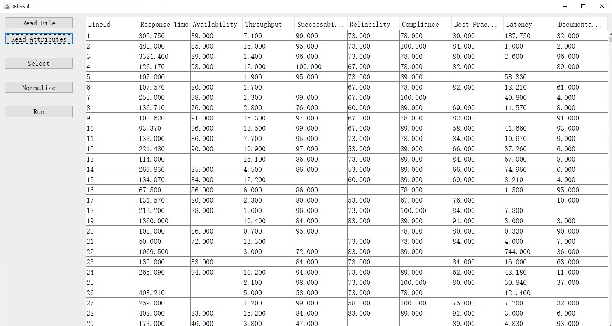
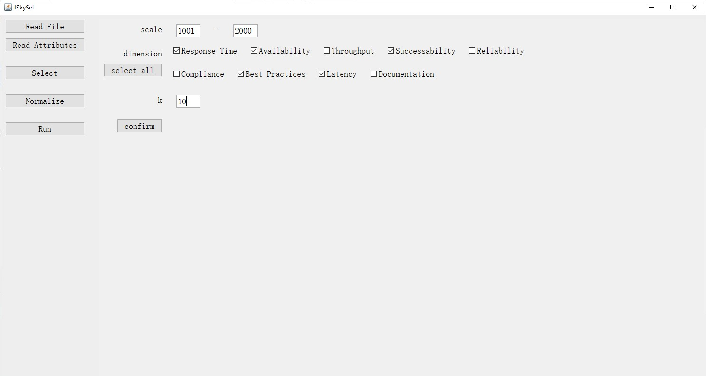
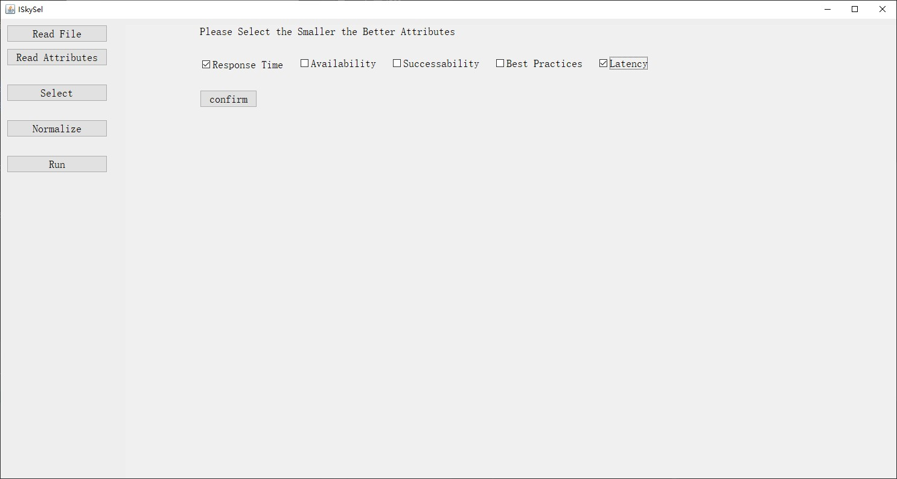
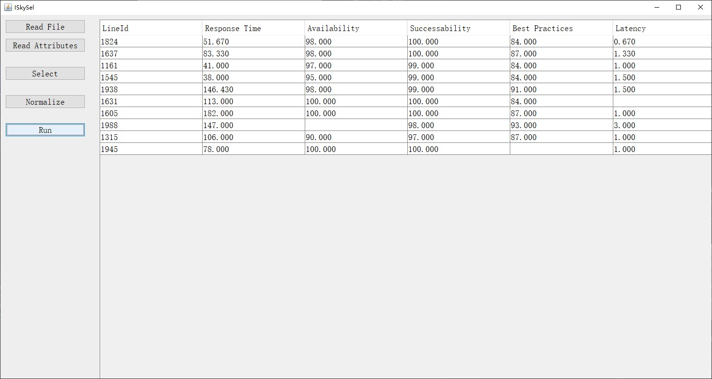

## Welcome to ISkySel Pages

This repository matains the Java implementation of interval-valued skyline service selection on the incomplete QoS dataset.

You can read more information about the algorithm from our publication:

* Interval-valued Skyline Web Service Selection on Incomplete QoS, submmited for ICWS 2022.

## Dependencies

Java 1.8 ([https://www.oracle.com/](https://www.oracle.com/))

## Usage
We provide two ways to use IQSRec: (1) use java instance (2) gui start

### Instance

You can get the usage by reading `UsageDemo.java`.

### GUI Start

#### Step 1. Read Data
Be attention, the format of input should be like in the 'data/qws_rate_0.1.txt' (separated by space or ',')

#### Step 2. Select Data
In this step, you can select the dimensions and services you're interested.

#### Step 3. Normalize Data

By default, all QoS attributes that larger is better. So we need to know which attributes are smaller is better.
As the figure shown, "Response Time" and "Latency" should be selected.

#### Step 4. Run
Click "Run", you can get the result.

## Feedback

If you find any bugs or errors, please post to our issue page.
